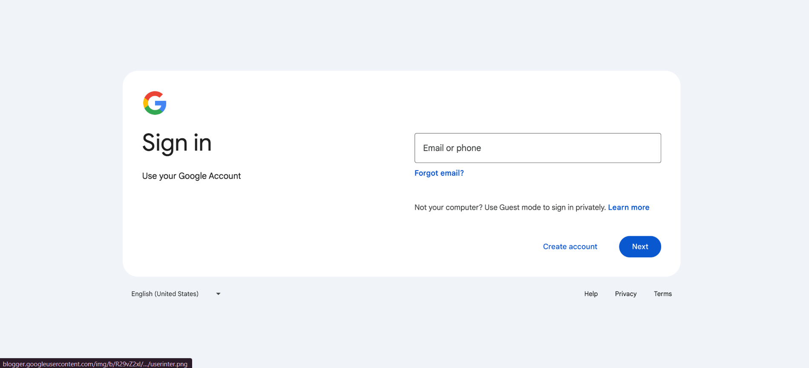
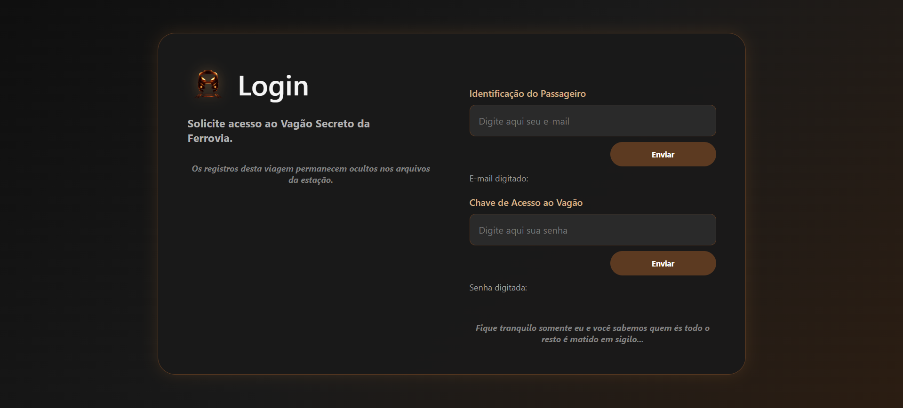

# 🚂 Vagão Secreto da Ferrovia - Sistema de Login Personalizado

Este é um projeto de um pequeno sistema de login com interface inspirada na estrutura visual clássica de autenticação do Google, porém totalmente estilizada com uma temática clandestina e imersiva. O design foi personalizado para simular o controle de acesso de um **vagão de trem de criminosos** que necessitam manter suas comunicações e registros sob absoluto sigilo.

---

## 🎨 Comparação de Interfaces

Para entender a transformação do projeto, veja abaixo a diferença entre a inspiração original e a versão customizada para os passageiros do vagão.

### 🌐 1. Interface Oficial (Inspiração)
Esta é a interface padrão do Google que serviu de base estrutural para o projeto (organização dos inputs, botões e textos de apoio).

* **Estilo:** Fundo claro, minimalista e corporativo.
* **Cores:** Primárias vivas (Azul, Vermelho, Amarelo e Verde).



---

### 🥷 2. Interface dos Criminosos (Resultado Personalizado)
Esta é a versão adaptada para o Vagão Secreto da Ferrovia, modificada para garantir a imersão e o clima de absoluto sigilo dos usuários.

* **Estilo:** Dark mode customizado com elementos visuais temáticos de ferrovias.
* **Cores:** Tons escuros, marrom e bordas com brilho âmbar.
* **Mensagens:** Textos totalmente modificados para criar uma atmosfera misteriosa.



---

## 🛠️ Tecnologias Sugeridas / Utilizadas

* **HTML5:** Estruturação semântica dos campos de entrada e blocos de conteúdo.
* **CSS3:** Estilização avançada para o tema escuro, bordas arredondadas, efeitos de prevenção de brilho (*box-shadow* em tons de âmbar) e tipografia.
* **JavaScript:** Manipulação de eventos para capturar as entradas e atualizar os estados exibidos na tela (como as seções "E-mail digitado:" e "Senha digitada:").

---

## ⚙️ Funcionalidades e Elementos da Interface

1. **Identificação do Passageiro (E-mail):** Campo para o usuário inserir sua credencial de acesso inicial sob o rótulo temático.
2. **Chave de Acesso ao Vagão (Senha):** Campo dedicado para a inserção da senha secreta.
3. **Feedback em Tempo Real:** Exibição dinâmica dos dados processados ou digitados logo abaixo de cada botão de envio.
4. **Mensagens Imersivas (Lore/Ambientação):**
   * *"Solicite acesso ao Vagão Secreto da Ferrovia."*
   * *"Os registros desta viagem permanecem ocultos nos arquivos da estação."*
   * *"Fique tranquilo somente eu e você sabemos quem és todo o resto é mantido em sigilo..."*

---

## 📂 Como Executar o Projeto Localmente

1. Clone este repositório para a sua máquina local:
   ```bash
   git clone [https://github.com/seu-usuario/vagao-secreto-login.git](https://github.com/seu-usuario/vagao-secreto-login.git)
   git clone [https://github.com/seu-usuario/vagao-secreto-login.git](https://github.com/seu-usuario/vagao-secreto-login.git)
